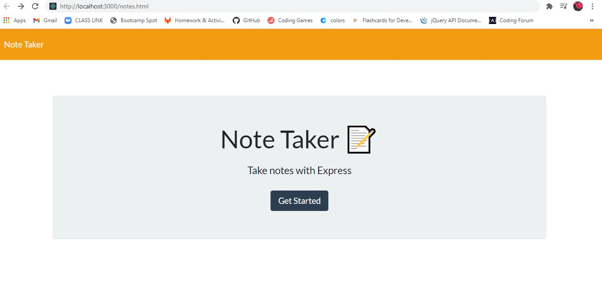
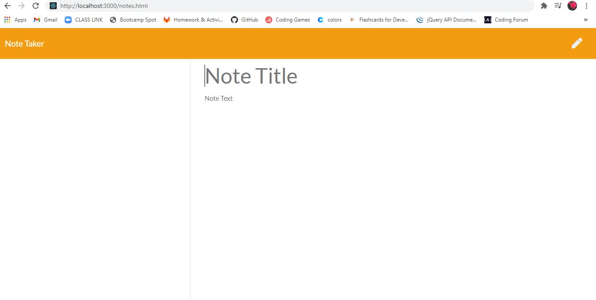
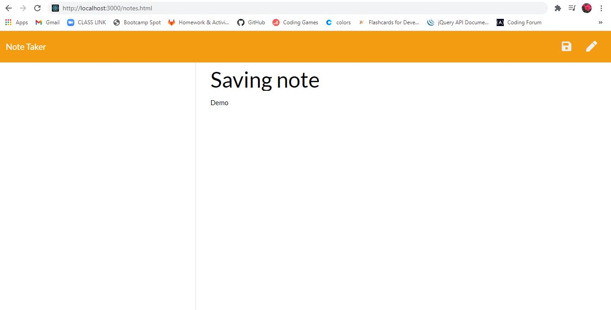

# Express noteTaker
## Instructions
Create an application that can be used to write, save, and delete notes. This application will use an express backend and save and retrieve note data from a JSON file.
## Heroku Development 
https://git.heroku.com/notetaker2345t.git
## Demo

